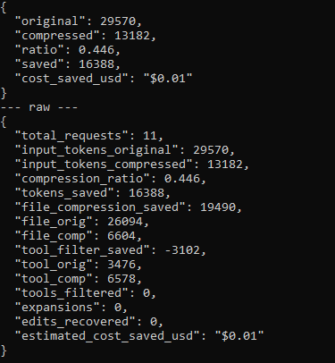
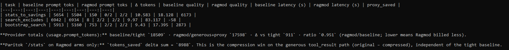
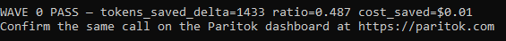

# Ragmod

[](https://github.com/Paritok-official/paritok-4b-v1)

**Over-retrieve on purpose. Paritok makes it affordable.**

A CLI codebase agent: ask a question about a local repo, get an answer with `file:line` citations. Retrieval is intentionally generous (200 search hits, ±40 line reads) and always lands as OpenAI `tool_result`s — the shape [Paritok](https://github.com/Paritok-official/paritok-4b-v1)’s compressor is trained on.

Built with [Paritok](https://github.com/Paritok-official/paritok-4b-v1).

---

## Measured results

Ragmod’s contribution is the **retrieval policy** + **message shape**. Paritok’s is the **compression**. Full receipts: [`docs/PROOF.md`](docs/PROOF.md).

### Live ask — `/stats`

One question against this repo through the hosted-GPU proxy (`ragmod stats` output):



### A/B bench — tight vs generous+Paritok

Same three tasks, regenerated 2026-08-15 (`ragmod bench` summary):



| | Value |
|---|---:|
| Paritok `proxy_saved` (3 tasks) | **3,103** |
| Provider prompt toks — tight baseline | 14,503 |
| Provider prompt toks — Ragmod + proxy | **24,710** |
| Δ vs tight (billed) | **−10,207** (ratio **1.70**, Ragmod billed *more*) |

Full table: [`examples/savings_table.md`](examples/savings_table.md).

This run landed on the side of the tradeoff we document rather than hide (see [`docs/PROOF.md`](docs/PROOF.md)): the ragmod arm also hit its turn budget on one task (`stats_to_savings`) without producing a usable answer, scoring 0/2 there while matching baseline's 2/2 on the other two — and `/stats` still shows real compression on the generous path (**3,103** tokens) regardless. An earlier run (2026-08-04) came out the other way: **−5,147** vs tight (Ragmod billed *less*), quality 2/2, 2/2, 1/2 on both arms. Both are genuine, reproducible outcomes of the same code — re-run `ragmod bench` yourself to see where a given session lands.

### Wave 0 gate



`python scripts/wave0_smoke.py` **fails if `tokens_saved` ≤ 0**.

We report **our** measured numbers, not Paritok’s published 74%.

---

## Judge path (~10 minutes)

**Need:** Python 3.11+, a [Paritok](https://paritok.com) API key (`use_gpu_server`), and a free [Gemini](https://aistudio.google.com/apikey) (or Groq) key.

```bash
git clone https://github.com/reganlai/Ragmod
cd Ragmod
python3 -m venv .venv
source .venv/bin/activate   # Windows: .venv\Scripts\activate

pip install torch --index-url https://download.pytorch.org/whl/cpu
pip install -e ".[paritok]"

cp .env.example .env
# PARITOK_API_KEY=pk_live_...
# OPENAI_API_KEY=AIza...          # or GEMINI_API_KEY
# RAGMOD_OPENAI_URL + RAGMOD_MODEL — see .env.example
```

**Terminal 1** (keep open):

```bash
source .venv/bin/activate
./scripts/start_proxy.sh
# expect: Hosted GPU server OK — API key accepted
```

**Terminal 2:**

```bash
source .venv/bin/activate
pytest -q
python scripts/wave0_smoke.py                      # WAVE 0 PASS
ragmod ask "How does the proxy turn raw stats into savings?" --repo .
ragmod stats                                       # tokens_saved > 0
```

Optional: `ragmod bench --repo . --out examples/savings_table.md` (~3–5 min).

Confirm traffic on the [Paritok dashboard](https://paritok.com).

### Expected ask shape

```
… stats_to_savings …

Sources:
- ragmod/gateway/proxy.py:…

Turns: 2
```

Sample answer: [`examples/wave1_ask.txt`](examples/wave1_ask.txt).

---

## What Ragmod is

| Piece | Role |
|---|---|
| `tools/` | `search_repo`, `read_file`, `list_dir`, `run_tests` — generous by default |
| `agent/` | Multi-turn tool loop; citations from tool metadata |
| `gateway/` | Paritok proxy helpers + `/stats` → `SavingsStats` |
| `bench/` | A/B: tight baseline (direct) vs generous Ragmod (proxy) |

Every LLM call goes through the local Paritok proxy with **hosted GPU** (`use_gpu_server: true`). No direct provider SDK calls in the runtime path.

---

## Feedback

- [#19](https://github.com/Paritok-official/paritok-4b-v1/issues/19) — `/stats` on failed upstreams, A/B framing  
- [#22](https://github.com/Paritok-official/paritok-4b-v1/issues/22) — Gemini `thought_signature` vs synthetic tool bootstraps  

## License

Apache License 2.0 — see [LICENSE](LICENSE).
